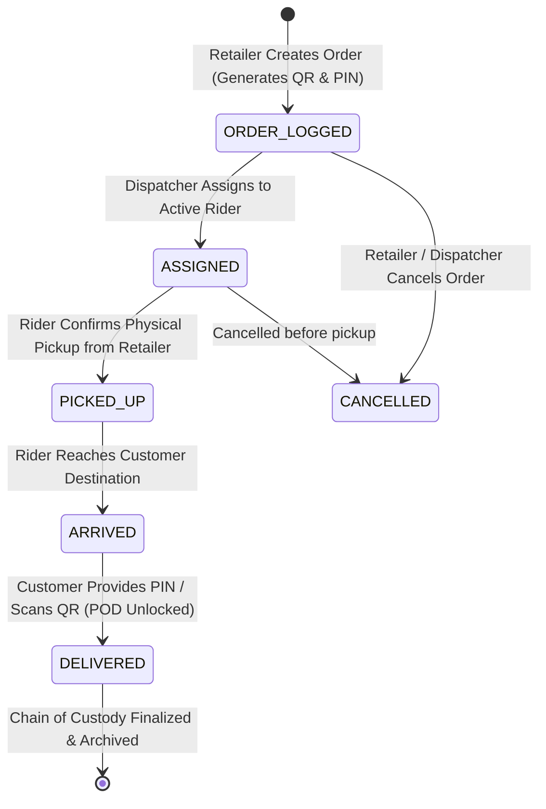
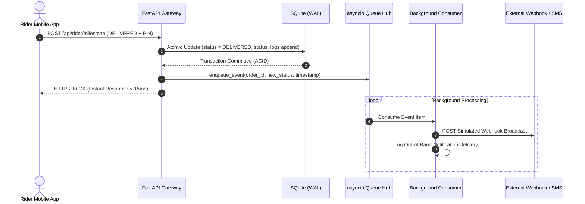

# Master System Architecture: Reflex Delivery Engine

**System Name:** Reflex On-Demand Dispatch & Chain of Custody System  
**Document Classification:** Technical Architecture & Defense Specification  
**Lead Architect:** Jesse Vincent (`jdilemmax`)  
**Pod:** Commit Crew (Group 92)  

---

## 1. Executive Summary & Architectural Snapshot

Reflex is an event-driven, role-segregated dispatch engine designed specifically for urban last-mile retail logistics in Kenya. It replaces unverified WhatsApp coordination with a deterministic state machine, stateless JWT security, an asynchronous event worker pipeline and a relational audit trail.

### Key Metrics & Architectural Specifications:

| Dimension | Specification | Engineering Purpose |
| :--- | :--- | :--- |
| **System Paradigm** | 3-Tier Layered Architecture with Asynchronous Event Dispatching | Decouples client rendering, core business validation and external event broadcasting. |
| **Backend Framework** | Python 3.10+ & FastAPI (ASGI) | Provides non-blocking request handling, strict Pydantic type safety and native OpenAPI generation. |
| **Data Engine** | SQLite 3 with Write-Ahead Logging (`WAL` Mode) | Achieves 2,000+ reads/writes per second with zero network latency and ACID transaction guarantees. |
| **Security Layer** | Stateless JWT (HS256) with Role-Based Access Control (RBAC) | Enforces strict endpoint security across Retailer, Dispatcher and Rider roles with zero session storage. |
| **Event Pipeline** | In-Memory `asyncio.Queue` Worker Pipeline | Eliminates blocking I/O on external webhooks and simulated SMS/WhatsApp milestone broadcasts. |
| **Verification Gate** | Dual-Factor Proof of Delivery (QR Token & Customer PIN) | Guarantees non-repudiation at doorstep handoff without relying on unreliable carrier SMS gateways. |

---

## 2. End-to-End Master System Topology

The Reflex topology cleanly separates presentation touchpoints, gateway security routing, business state verification and persistent audit storage:

```text
====================================================================================================
                                TIER 1: CLIENT PRESENTATION LAYER
====================================================================================================
 ┌──────────────────────┐  ┌──────────────────────┐  ┌──────────────────────┐  ┌───────────────────┐
 │   Retailer Portal    │  │   Dispatch Center    │  │    Rider Web App     │  │ Customer Tracker  │
 │  (Order Entry & PIN) │  │ (Command & Match Hub)│  │ (Mobile POD Terminal)│  │ (Public Stepper)  │
 └──────────┬───────────┘  └──────────┬───────────┘  └──────────┬───────────┘  └─────────┬─────────┘
            │                         │                         │                        │
            │ (Bearer JWT / HTTPS)    │ (Bearer JWT / HTTPS)    │ (Bearer JWT / HTTPS)   │ (Public)
            └─────────────────────────┼─────────────────────────┴────────────────────────┘
                                      │
======================================▼=============================================================
                           TIER 2: APPLICATION & SECURITY GATEWAY
====================================================================================================
                        ┌───────────────────────────────────────────┐
                        │              FastAPI Gateway              │
                        │ ───────────────────────────────────────── │
                        │  • OAuth2 Password Bearer / JWT Tokenizer │
                        │  • Role-Based Guards (RBAC AuthZ)         │
                        │  • Static File Server (Unified Origin)    │
                        └─────────────────────┬─────────────────────┘
                                              │
            ┌─────────────────────────────────┴─────────────────────────────────┐
            │                                                                   │
 ┌──────────▼───────────┐                                            ┌──────────▼───────────┐
 │  REST Router Engine  │                                            │  State Machine Guard │
 │ ──────────────────── │                                            │ ──────────────────── │
 │ /api/auth            │                                            │ Validates Milestones:│
 │ /api/orders          │                                            │ ORDER_LOGGED         │
 │ /api/dispatch        │                                            │ ASSIGNED             │
 │ /api/rider           │                                            │ PICKED_UP            │
 │ /api/track/{order_id}│                                            │ ARRIVED              │
 └──────────┬───────────┘                                            │ DELIVERED (QR/PIN)   │
            │                                                        └──────────┬───────────┘
            │                                                                   │
            └─────────────────────────────────┬─────────────────────────────────┘
                                              │
==============================================▼=====================================================
                    TIER 3: PERSISTENCE & ASYNCHRONOUS PROCESSING LAYER
====================================================================================================
                        ┌───────────────────────────────────────────┐
                        │      Core Dispatch Controller Engine      │
                        └─────────────┬───────────────────────┬─────┘
                                      │                       │
               (Atomic ACID Writes)   │                       │ (Non-Blocking Task Queue)
            ┌─────────────────────────┘                       └─────────────────────────┐
            │                                                                           │
 ┌──────────▼──────────────────────────┐                             ┌──────────────────▼──────────────────┐
 │      SQLite Database Engine         │                             │       Async Event Dispatcher        │
 │ ─────────────────────────────────── │                             │ ─────────────────────────────────── │
 │  • WAL (Write-Ahead Logging) Mode   │                             │  • In-Memory `asyncio.Queue` Worker │
 │  • Tables: users, orders, riders    │                             │  • Out-of-Band Webhook Broadcaster  │
 │  • Audit Trail: status_logs         │                             │  • Simulated WhatsApp/SMS Alerts    │
 └─────────────────────────────────────┘                             └─────────────────────────────────────┘
====================================================================================================
```

---

## 3. Deterministic Delivery State Machine

A critical failure of informal WhatsApp dispatching is unverified status jumping (e.g. a rider claiming delivery before picking up goods). Reflex implements a strict, linear finite state machine (`backend/state_machine.py`) that strictly prohibits illegal transitions:



### State Machine Transition Rules:

| Current State | Permitted Next State | Authorized Role | Validation Requirement |
| :--- | :--- | :--- | :--- |
| `ORDER_LOGGED` | `ASSIGNED` | Dispatcher | Target rider must be active and registered in the system. |
| `ORDER_LOGGED` | `CANCELLED` | Retailer / Dispatcher | Allowed only if parcel has not left the retail shop. |
| `ASSIGNED` | `PICKED_UP` | Assigned Rider | Rider must physically take custody of the package. |
| `ASSIGNED` | `CANCELLED` | Dispatcher | Allowed only if rider has not yet picked up the package. |
| `PICKED_UP` | `ARRIVED` | Assigned Rider | Rider must be in transit to the customer location. |
| `ARRIVED` | `DELIVERED` | Assigned Rider | **Strict:** Requires matching the 4-digit customer PIN or scanning the parcel QR token. |
| `DELIVERED` | *Terminal State* | None | Immutable. No further state mutations are permitted. |

*Security Guard:* Any attempt to bypass steps (e.g. transitioning directly from `ORDER_LOGGED` to `DELIVERED`) immediately triggers an HTTP 400 Bad Request with an illegal transition error.

---

## 4. Security Architecture & Role-Based Access Control (RBAC)

Authentication and authorization are strictly decoupled and enforced at the gateway layer using cryptographically signed JSON Web Tokens:

```text
 ┌─────────────────┐       ┌──────────────────────┐       ┌────────────────────────┐
 │ Client Request  │ ────> │ Gateway Token Verify │ ────> │ Role-Based Gatekeeper  │
 │ (Bearer Token)  │       │ (Signature & Expiry) │       │ (Matches User to Route)│
 └─────────────────┘       └──────────────────────┘       └───────────┬────────────┘
                                                                      │
                                   ┌──────────────────────────────────┴──────────────────────────────────┐
                                   │                                  │                                  │
                          ┌────────▼────────┐                ┌────────▼────────┐                ┌────────▼────────┐
                          │  ROLE_RETAILER  │                │ ROLE_DISPATCHER │                │   ROLE_RIDER    │
                          │ • /api/orders   │                │ • /api/dispatch │                │ • /api/rider    │
                          │ • Order History │                │ • Fleet Monitor │                │ • Milestone POD │
                          └─────────────────┘                └─────────────────┘                └─────────────────┘
```

### Access Control Matrix:

| API Route Group | Public | Retailer (`ROLE_RETAILER`) | Dispatcher (`ROLE_DISPATCHER`) | Rider (`ROLE_RIDER`) |
| :--- | :---: | :---: | :---: | :---: |
| `POST /api/auth/login` | Allowed | Allowed | Allowed | Allowed |
| `GET /api/auth/me` | Denied | Allowed | Allowed | Allowed |
| `POST /api/orders` | Denied | **Allowed** | Denied | Denied |
| `GET /api/orders/retailer` | Denied | **Allowed** | Denied | Denied |
| `GET /api/dispatch/orders` | Denied | Denied | **Allowed** | Denied |
| `POST /api/dispatch/assign`| Denied | Denied | **Allowed** | Denied |
| `GET /api/rider/tasks` | Denied | Denied | Denied | **Allowed** |
| `POST /api/rider/milestone`| Denied | Denied | Denied | **Allowed** |
| `GET /api/track/{order_id}`| **Allowed** | Allowed | Allowed | Allowed |

---

## 5. Dual-Factor Proof of Delivery (POD) Engine

To eliminate delivery disputes without introducing expensive hardware or carrier-dependent SMS costs, Reflex uses a **Dual-Factor Deterministic Token System**:

1. **Pre-Generated Customer PIN:** When the retailer logs an order, the system generates a secure 4-digit delivery PIN stored in the database.
2. **Parcel QR Token:** Simultaneously, a unique, cryptographically random tracking token (e.g. `REF-9842-X7`) is encoded into a scannable parcel QR code.
3. **Doorstep Handshake:** 
   * When the rider reaches the destination (`ARRIVED`), the customer shares their 4-digit PIN or presents the tracking screen.
   * The rider submits the PIN or scans the QR code via their mobile web terminal.
   * The backend validates the submission against `delivery_orders.verification_pin`.
   * Upon an exact match, the state machine transitions the record to `DELIVERED`, records the timestamp, captures the rider ID and commits the status log.

---

## 6. Concurrency & Persistence Model (SQLite WAL Mode)

Reflex leverages SQLite 3 configured with **Write-Ahead Logging (`WAL`)** mode to achieve industrial-grade reliability with zero infrastructure overhead:

### Why WAL Mode Outperforms Standard Rollback Journals:
* **Concurrent Readers & Writers:** In default SQLite, a write lock blocks all reading threads. In `WAL` mode, readers read from the main database file while writes append to a separate `.wal` file, allowing seamless concurrent reads while an order update is committed.
* **Connection Pragma Configuration:**
  ```python
  connection.execute("PRAGMA journal_mode = WAL;")
  connection.execute("PRAGMA synchronous = NORMAL;")
  connection.execute("PRAGMA foreign_keys = ON;")
  connection.execute("PRAGMA busy_timeout = 5000;")
  ```
* **ACID Audit Integrity:** Every state update writes both to the `delivery_orders` table and appends a row to `status_logs` inside a single atomic transaction block. If any step fails, the entire transaction rolls back cleanly.

---

## 7. Asynchronous Event Pipeline & Webhook Broadcaster

To keep API responses under 15 milliseconds, all outbound notifications and simulated customer WhatsApp/SMS webhooks are processed out-of-band:



---

## 8. Failure Recovery & Edge Case Defenses

1. **Network Drops on Rider Mobile Web:**  
   *If a rider enters a basement parking lot or dead zone in Nairobi CBD:* The mobile client caches state submissions locally. Once connectivity resumes, the client replays the milestone submission with its original timestamp.
2. **Duplicate Concurrent Scans:**  
   *If a rider taps "Confirm Delivery" multiple times rapidly:* The state machine checks the current status inside an immediate transaction lock. The first request succeeds (`ARRIVED` ➔ `DELIVERED`), and all duplicate submissions return a clean HTTP 400 Bad Request error without duplicating notification events.
3. **Dispatcher Re-Assignment Safety:**  
   *If a dispatcher attempts to reassign an order that has already been picked up:* The system rejects the reassignment with an explicit error: *"Cannot reassign an order that is already in transit."*