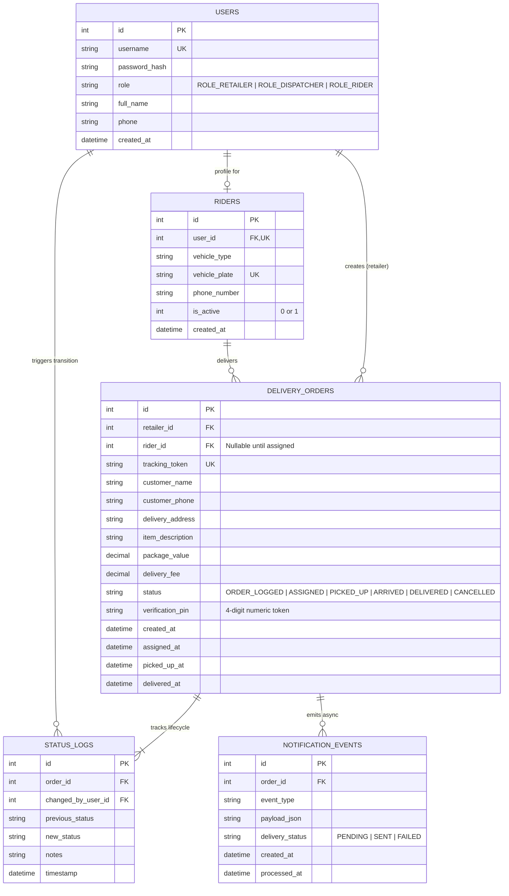

# Entity Relationship Diagram (ERD) & Relational Schema Specification

**System Name:** Reflex On-Demand Dispatch & Chain of Custody System  
**Document Classification:** Database Architecture & Data Dictionary  
**Lead Architect:** Jesse Vincent (`jdilemmax`)  
**Pod:** Commit Crew (Group 92)  

---

## 1. Executive Summary & Data Architecture Snapshot

The Reflex relational data model is engineered to enforce strict chain-of-custody tracking, sub-millisecond query performance and complete transaction immutability. Built on SQLite 3 with Write-Ahead Logging (`WAL`), the schema isolates authentication credentials, fleet telemetry, order lifecycles and historical status audits.

### Key Data Architecture Metrics:

| Metric | Specification | Architectural Justification |
| :--- | :--- | :--- |
| **Relational Model** | 3rd Normal Form (3NF) Relational Schema | Eliminates data redundancy while preserving referential integrity across dispatches. |
| **Storage Engine** | SQLite 3 (`WAL` Mode Enabled) | Delivers non-blocking concurrent reads during active order write transactions. |
| **Audit Philosophy** | Append-Only Status Audit Trail (`status_logs`) | Guarantees non-repudiation and complete forensic traceability for every delivery milestone. |
| **Indexing Strategy** | Targeted B-Tree Covering Indexes | Guarantees sub-5ms lookups on public customer tracking tokens and live dispatch queues. |
| **Key Constraints** | Strict Foreign Key Enforcement (`PRAGMA foreign_keys = ON;`) | Prevents orphaned delivery records or untracked state mutations at the database level. |

---

## 2. Visual Entity Relationship Diagram

### Visual ERD (Mermaid Notation)



---

## 3. Relational Data Dictionary

### Table 1: `users` (Core Identity & Role-Based Access)
Stores system user accounts, hashed credentials and role assignments across Retailers, Dispatchers and Riders.

| Column Name | Data Type | Constraints | Description |
| :--- | :--- | :--- | :--- |
| `id` | `INTEGER` | `PRIMARY KEY AUTOINCREMENT` | Unique internal user identifier. |
| `username` | `TEXT` | `NOT NULL UNIQUE` | Unique login username (e.g. `luthuli_electronics`). |
| `password_hash` | `TEXT` | `NOT NULL` | Cryptographic password hash generated via Passlib (PBKDF2-SHA256). |
| `role` | `TEXT` | `NOT NULL CHECK (role IN ('ROLE_RETAILER', 'ROLE_DISPATCHER', 'ROLE_RIDER'))` | Enforces Role-Based Access Control (RBAC). |
| `full_name` | `TEXT` | `NOT NULL` | Display name of the user or business entity. |
| `phone` | `TEXT` | `NOT NULL` | Primary contact telephone number. |
| `created_at` | `TIMESTAMP` | `DEFAULT CURRENT_TIMESTAMP` | Account creation timestamp. |

---

### Table 2: `riders` (Fleet Telemetry & Vehicle Metadata)
Extends rider user accounts with specific transportation metadata and real-time fleet availability status.

| Column Name | Data Type | Constraints | Description |
| :--- | :--- | :--- | :--- |
| `id` | `INTEGER` | `PRIMARY KEY AUTOINCREMENT` | Unique internal rider record identifier. |
| `user_id` | `INTEGER` | `NOT NULL UNIQUE REFERENCES users(id) ON DELETE CASCADE` | 1-to-1 foreign key mapping to the rider's `users` record. |
| `vehicle_type` | `TEXT` | `NOT NULL DEFAULT 'Motorcycle'` | Type of transportation (e.g. `Motorcycle (Boxer 150)`, `Bicycle`, `Van`). |
| `vehicle_plate` | `TEXT` | `NOT NULL UNIQUE` | Official vehicle registration number (e.g. `KMDF 420X`). |
| `phone_number` | `TEXT` | `NOT NULL` | Active direct line for dispatcher calls. |
| `is_active` | `INTEGER` | `NOT NULL DEFAULT 1 CHECK (is_active IN (0, 1))` | Fleet availability flag (1 = Active/Online, 0 = Inactive/Offline). |
| `created_at` | `TIMESTAMP` | `DEFAULT CURRENT_TIMESTAMP` | Fleet registration timestamp. |

---

### Table 3: `delivery_orders` (Core Delivery Entity & State Machine)
The central transaction table tracking parcel details, recipient data, deterministic status states and verification tokens.

| Column Name | Data Type | Constraints | Description |
| :--- | :--- | :--- | :--- |
| `id` | `INTEGER` | `PRIMARY KEY AUTOINCREMENT` | Unique internal order identifier. |
| `retailer_id` | `INTEGER` | `NOT NULL REFERENCES users(id) ON DELETE RESTRICT` | Foreign key linking the order to the originating retail merchant. |
| `rider_id` | `INTEGER` | `NULL REFERENCES riders(id) ON DELETE SET NULL` | Foreign key linking the order to the assigned courier (NULL when unassigned). |
| `tracking_token` | `TEXT` | `NOT NULL UNIQUE` | Cryptographically random public tracking token (e.g. `REF-8492-X1`). |
| `customer_name` | `TEXT` | `NOT NULL` | Full name of the destination parcel recipient. |
| `customer_phone`| `TEXT` | `NOT NULL` | Recipient phone number for delivery contact and tracking link dispatch. |
| `delivery_address`| `TEXT`| `NOT NULL` | Precise street address or building details (e.g. *Bazaar Plaza, 4th Floor*). |
| `item_description`| `TEXT`| `NOT NULL` | Description of parcel contents (e.g. *HP Laptop Charger & Wireless Mouse*). |
| `package_value` | `REAL` | `NOT NULL DEFAULT 0.0 CHECK (package_value >= 0)` | Declared commercial value of the parcel in KES. |
| `delivery_fee` | `REAL` | `NOT NULL DEFAULT 0.0 CHECK (delivery_fee >= 0)` | Agreed courier delivery surcharge in KES. |
| `status` | `TEXT` | `NOT NULL DEFAULT 'ORDER_LOGGED' CHECK (status IN ('ORDER_LOGGED', 'ASSIGNED', 'PICKED_UP', 'ARRIVED', 'DELIVERED', 'CANCELLED'))` | Current lifecycle state enforced by the deterministic state machine. |
| `verification_pin`| `TEXT`| `NOT NULL` | 4-digit numeric proof-of-delivery secret (e.g. `4829`). |
| `created_at` | `TIMESTAMP` | `DEFAULT CURRENT_TIMESTAMP` | Order entry timestamp. |
| `assigned_at` | `TIMESTAMP` | `NULL` | Timestamp when the dispatcher assigned the order to a rider. |
| `picked_up_at` | `TIMESTAMP` | `NULL` | Timestamp when the rider confirmed physical package custody. |
| `delivered_at` | `TIMESTAMP` | `NULL` | Timestamp when the delivery was finalized via PIN/QR verification. |

---

### Table 4: `status_logs` (Append-Only Chain of Custody Audit Trail)
An immutable ledger recording every milestone mutation, capturing the exact user responsible, transition delta and timestamp.

| Column Name | Data Type | Constraints | Description |
| :--- | :--- | :--- | :--- |
| `id` | `INTEGER` | `PRIMARY KEY AUTOINCREMENT` | Unique audit log entry identifier. |
| `order_id` | `INTEGER` | `NOT NULL REFERENCES delivery_orders(id) ON DELETE CASCADE` | Foreign key linking the audit entry to the parent delivery order. |
| `changed_by_user_id`| `INTEGER` | `NOT NULL REFERENCES users(id) ON DELETE RESTRICT` | User identity responsible for executing the state transition. |
| `previous_status`| `TEXT` | `NULL` | Prior lifecycle state before mutation. |
| `new_status` | `TEXT` | `NOT NULL` | Updated lifecycle state following validation. |
| `notes` | `TEXT` | `NULL` | Optional audit annotation or cancellation explanation. |
| `timestamp` | `TIMESTAMP` | `DEFAULT CURRENT_TIMESTAMP` | Atomic timestamp of the state transition. |

---

### Table 5: `notification_events` (Asynchronous Webhook & Event Hub)
Buffers outbound notification jobs processed by the background `asyncio.Queue` worker pipeline.

| Column Name | Data Type | Constraints | Description |
| :--- | :--- | :--- | :--- |
| `id` | `INTEGER` | `PRIMARY KEY AUTOINCREMENT` | Unique event log identifier. |
| `order_id` | `INTEGER` | `NOT NULL REFERENCES delivery_orders(id) ON DELETE CASCADE` | Foreign key linking the event to the target delivery order. |
| `event_type` | `TEXT` | `NOT NULL` | Classification of event (e.g. `ORDER_CREATED`, `STATUS_CHANGED`, `POD_VERIFIED`). |
| `payload_json` | `TEXT` | `NOT NULL` | Serialized JSON payload broadcast to external webhooks or SMS logs. |
| `delivery_status`| `TEXT` | `NOT NULL DEFAULT 'PENDING' CHECK (delivery_status IN ('PENDING', 'SENT', 'FAILED'))` | Transmission state of the asynchronous event. |
| `created_at` | `TIMESTAMP` | `DEFAULT CURRENT_TIMESTAMP` | Event enqueue timestamp. |
| `processed_at` | `TIMESTAMP` | `NULL` | Timestamp when the background worker finalized dispatch. |

---

## 4. Indexing & Query Optimization Strategy

To guarantee instantaneous rendering across busy dispatch screens and zero latency on public tracking queries, Reflex defines targeted B-Tree indexes:

```sql
-- 1. Accelerates public customer milestone queries by tracking token (<1ms lookup)
CREATE UNIQUE INDEX IF NOT EXISTS idx_orders_tracking_token 
ON delivery_orders(tracking_token);

-- 2. Optimizes Dispatcher Live Command Board filtering by active status
CREATE INDEX IF NOT EXISTS idx_orders_status 
ON delivery_orders(status);

-- 3. Accelerates Retailer Portal order history filtering
CREATE INDEX IF NOT EXISTS idx_orders_retailer 
ON delivery_orders(retailer_id, created_at DESC);

-- 4. Optimizes Rider Mobile Terminal active task fetching
CREATE INDEX IF NOT EXISTS idx_orders_rider_status 
ON delivery_orders(rider_id, status);

-- 5. Accelerates chain-of-custody audit log retrieval per parcel
CREATE INDEX IF NOT EXISTS idx_status_logs_order_id 
ON status_logs(order_id, timestamp ASC);
```

---

## 5. Referential Integrity & Safety Policies

1. **Restricted Retailer Deletions:** If a retailer account has historical orders, deleting the user is prevented (`ON DELETE RESTRICT`) to protect financial and legal audit integrity.
2. **Preserved Rider Historical Deliveries:** If a rider profile is deactivated, past completed deliveries maintain their relational links (`ON DELETE SET NULL`), preventing corrupted historical records.
3. **Cascading Order Audits:** If a test or draft order is explicitly purged from the database, all child `status_logs` and `notification_events` records are cleanly wiped (`ON DELETE CASCADE`) to prevent orphaned entries.

---

## 6. Raw SQL Data Definition Language (DDL)

```sql
-- Reflex Core DDL Specification (data/schema.sql)
PRAGMA journal_mode = WAL;
PRAGMA foreign_keys = ON;

CREATE TABLE IF NOT EXISTS users (
    id INTEGER PRIMARY KEY AUTOINCREMENT,
    username TEXT NOT NULL UNIQUE,
    password_hash TEXT NOT NULL,
    role TEXT NOT NULL CHECK (role IN ('ROLE_RETAILER', 'ROLE_DISPATCHER', 'ROLE_RIDER')),
    full_name TEXT NOT NULL,
    phone TEXT NOT NULL,
    created_at TIMESTAMP DEFAULT CURRENT_TIMESTAMP
);

CREATE TABLE IF NOT EXISTS riders (
    id INTEGER PRIMARY KEY AUTOINCREMENT,
    user_id INTEGER NOT NULL UNIQUE REFERENCES users(id) ON DELETE CASCADE,
    vehicle_type TEXT NOT NULL DEFAULT 'Motorcycle',
    vehicle_plate TEXT NOT NULL UNIQUE,
    phone_number TEXT NOT NULL,
    is_active INTEGER NOT NULL DEFAULT 1 CHECK (is_active IN (0, 1)),
    created_at TIMESTAMP DEFAULT CURRENT_TIMESTAMP
);

CREATE TABLE IF NOT EXISTS delivery_orders (
    id INTEGER PRIMARY KEY AUTOINCREMENT,
    retailer_id INTEGER NOT NULL REFERENCES users(id) ON DELETE RESTRICT,
    rider_id INTEGER REFERENCES riders(id) ON DELETE SET NULL,
    tracking_token TEXT NOT NULL UNIQUE,
    customer_name TEXT NOT NULL,
    customer_phone TEXT NOT NULL,
    delivery_address TEXT NOT NULL,
    item_description TEXT NOT NULL,
    package_value REAL NOT NULL DEFAULT 0.0 CHECK (package_value >= 0),
    delivery_fee REAL NOT NULL DEFAULT 0.0 CHECK (delivery_fee >= 0),
    status TEXT NOT NULL DEFAULT 'ORDER_LOGGED' CHECK (status IN ('ORDER_LOGGED', 'ASSIGNED', 'PICKED_UP', 'ARRIVED', 'DELIVERED', 'CANCELLED')),
    verification_pin TEXT NOT NULL,
    created_at TIMESTAMP DEFAULT CURRENT_TIMESTAMP,
    assigned_at TIMESTAMP,
    picked_up_at TIMESTAMP,
    delivered_at TIMESTAMP
);

CREATE TABLE IF NOT EXISTS status_logs (
    id INTEGER PRIMARY KEY AUTOINCREMENT,
    order_id INTEGER NOT NULL REFERENCES delivery_orders(id) ON DELETE CASCADE,
    changed_by_user_id INTEGER NOT NULL REFERENCES users(id) ON DELETE RESTRICT,
    previous_status TEXT,
    new_status TEXT NOT NULL,
    notes TEXT,
    timestamp TIMESTAMP DEFAULT CURRENT_TIMESTAMP
);

CREATE TABLE IF NOT EXISTS notification_events (
    id INTEGER PRIMARY KEY AUTOINCREMENT,
    order_id INTEGER NOT NULL REFERENCES delivery_orders(id) ON DELETE CASCADE,
    event_type TEXT NOT NULL,
    payload_json TEXT NOT NULL,
    delivery_status TEXT NOT NULL DEFAULT 'PENDING' CHECK (delivery_status IN ('PENDING', 'SENT', 'FAILED')),
    created_at TIMESTAMP DEFAULT CURRENT_TIMESTAMP,
    processed_at TIMESTAMP
);
```